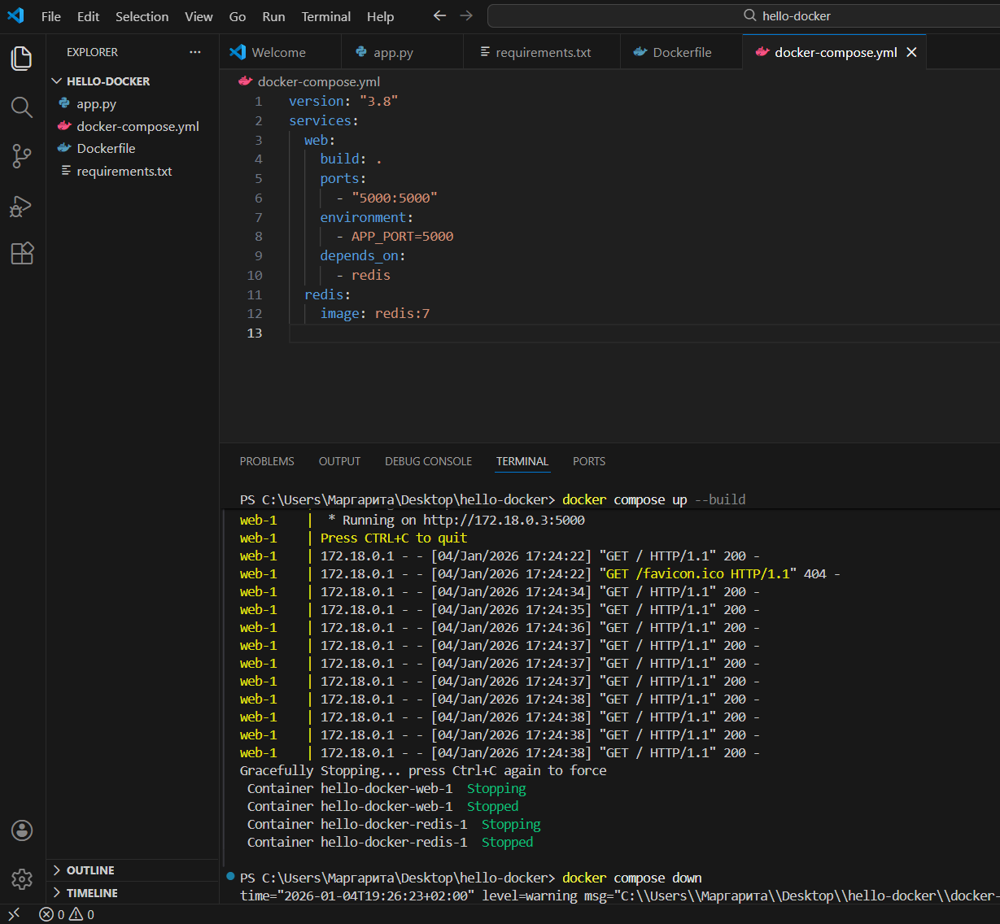
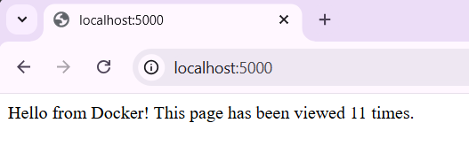

# hello-docker

## Мета
Навчитися працювати з директивами Dockerfile і запускати багатосервісний застосунок (Flask + Redis) за допомогою Docker Compose.

## Інструкція з запуску
1. Запустіть:  
   `docker compose up --build`
2. Перейдіть у браузері на `http://localhost:5000`, щоб побачити лічильник переглядів, який працює через Redis.

## Результати

## Висновки
У ході роботи:
Створено багатосервісний застосунок Flask + Redis.
Опрацьовано Dockerfile: налаштування середовища, встановлення залежностей, відкриття порту, запуск застосунку.
Використано Docker Compose для одночасного запуску кількох сервісів і організації їх взаємодії.
Перевірено роботу лічильника переглядів у браузері.
Навички роботи з контейнерами дозволяють швидко розгортати та тестувати застосунки в ізольованому середовищі.
